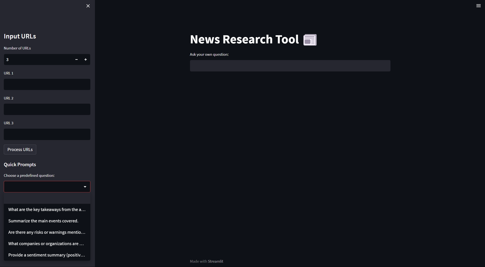

# AI-Powered News & Web Research Tool

This project is an **AI-driven news and web research tool** that combines document processing, vector similarity search, and question-answering capabilities to extract insights from online news articles or web content.

## Overview

- **Fetch article content** from URLs and process them into embeddings using **OpenAI embeddings**.
- **Store and index embeddings** using **FAISS** for efficient similarity search.
- **Ask questions about the articles** using an LLM (ChatGPT), with responses grounded in the indexed content.
- **Interactive interface** built with **Streamlit**, enabling users to input URLs, process content, and query the system.

## Key Technologies

- 🧠 **LangChain** - Document loading, text splitting, and retrieval pipeline design.
- 🧠 **OpenAI API** - Embedding generation and LLM-powered question answering.
- 🔍 **FAISS** - Vector similarity search for fast and accurate retrieval.
- 🌐 **Streamlit** - Building interactive AI-powered web applications.
- 🐍 **Python** - Full orchestration of the data pipeline, vector processing, and LLM interaction.

## Improvements Over the Original Version

This project builds on concepts from the **Codebasics LangChain tutorial** with several key enhancements:

✅ **Pre-configured Quick Prompts** - Users can select common research questions directly.  
✅ **UI Test Mode** - Full UI preview without requiring an OpenAI key.  
✅ **Better Error Handling** - Validates URLs and displays clear error messages.  
✅ **Dynamic & Cleaner UI** - Users can adjust the number of URLs dynamically.  
✅ **Smarter FAISS Index Handling** - Avoids unnecessary overwrites and provides clearer progress feedback.

## Future Enhancements (In the Pipeline)

🚀 **Text File Uploads** - Support for processing offline `.txt` documents.  
🚀 **Session Management** - Save and reload research sessions with timestamped FAISS indexes.  
🚀 **Automatic Summarization & Tagging** - Generate article summaries and detect key topics automatically.  
🚀 **Hybrid Search** - Combine keyword filtering with FAISS similarity search.  
🚀 **Multilingual Support** - Process and query content in multiple languages.  
🚀 **Related Article Scraping** - Suggest and fetch additional articles from the same source.

## FAISS Index Handling

The FAISS index, which stores the article embeddings, is **not included in this repository**. On the first run, the system will automatically:

- Download and process the articles.
- Generate embeddings using OpenAI's API.
- Build a new FAISS index from scratch.
- Save the index locally (typically as `faiss_store_openai.pkl`).

This ensures the latest articles are processed, but may result in **slower startup times** on the initial run.

To speed up subsequent runs, the FAISS index file can be retained locally, but it is excluded from version control.

## How to Use

1. **Enter Article URLs**  
   Open the Streamlit app and enter one or more URLs pointing to any online articles or webpages you want to analyze.

2. **Process the Articles**  
   Click the **Process URLs** button to load, split, and process the articles into embeddings. The system will store these embeddings in a FAISS index.

3. **Ask Questions**  
   Once processing is complete, you can enter questions such as:
   > What are the key points mentioned in the articles?

   The system will retrieve relevant information and provide an answer.

4. **Repeat for New Articles**  
   You can continue adding new URLs or clear the previous data to process a fresh batch of articles.

## UI Screenshot

Below is a screenshot of the application interface:

## Acknowledgement

This project was created by following and extending concepts from the [Codebasics LangChain tutorial](https://github.com/codebasics/langchain). 

## Quick Start

Explore the code in `main.py` to see how the different components work together to power this **AI-based news research tool**.
